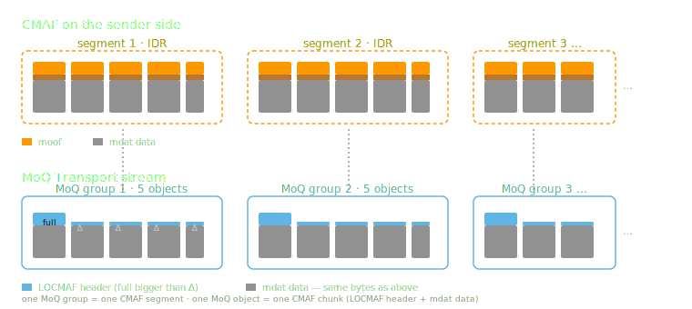
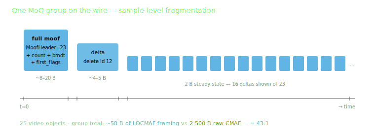
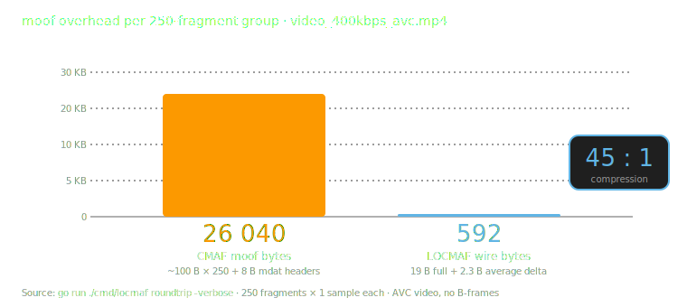
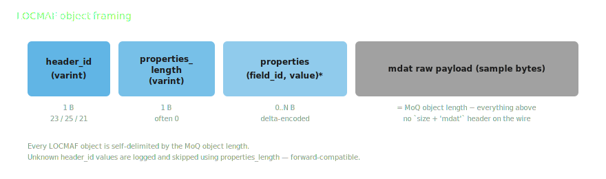

<!-- _class: lead -->

# LOCMAF
## Low Overhead CMAF for MOQ

<br>

Hugo Björs (MSc thesis) · Torbjörn Einarsson · Eyevinn · 2026

---

# Why a new packaging format?

- CMAF chunk = one `moof` + one `mdat`
- **Single-sample CMAF chunk header is ~104 B** of metadata
- LOC (~9 B) and WebCodecs carry **codec frames only** — no DRM, no CMAF semantics
- For low latency we want sample-level objects —
  moof overhead becomes a meaningful share of the wire cost (~25 % for low-bitrate audio)

> LOCMAF closes the gap to **as little as 2 bytes per delta moof** — and the same
> approach extends to **DRM-protected content** (`cenc` / `cbcs`, per-sample IVs,
> subsample maps carried verbatim, transparent to the CDM).

---

# The shape of the compression


- Big CMAF chunks on the sender side
- Tiny LOCMAF deltas on the wire — **as low as 2 B per moof** (~45 : 1 on clear-content moof bytes)
- **Functionally lossless** CMAF chunks reconstructed on the receiver
- **Same shape for clear and DRM-protected content** — encrypted `mdat`, IVs, subsample maps round-trip unchanged

Sample bytes are byte-identical; framing is regenerated from the LOCMAF fields and catalog init.

---

<!-- _class: section -->

# How MoQ groups map to CMAF

---

# One group per segment, one object per chunk



- **Group boundary = random access point** (IDR for video)
- **Object = one CMAF chunk** (one `moof` + one `mdat`)
- Audio groups are aligned to video groups so tune-in is a joint operation

---

# Inside a group: ordered objects

- Each group is independent — a new subscriber can start at any group
- Inside a group, objects are delivered in order
- **The interesting part is the series of `moof` boxes**:
  consecutive `moof` headers are almost identical

---

<!-- _class: section -->

# Where LOCMAF wins:<br>the moof delta stream

---

# A moof has very predictable structure


---

# Two-stage compression

1. **Tfhd against trex defaults.**
   If `tfhd` already matches the `trex` defaults in the moov, omit it.
2. **Delta encoding within a group.**
   First `moof` per group is *full*; every subsequent `moof` is a *delta*
   carrying only what changed. BMDT is derived from the previous moof.

`mdat` size is implied by the MoQ object length — the 8-byte `size + 'mdat'`
box header never goes on the wire.

---

# On the wire — one MoQ group



- Steady-state delta moof = **2 bytes** (header_id varint + length varint = 0)
- IDR / discontinuity transitions cost a handful of extra bytes
- The rest of the group runs flat

---

# Measured compression



---

# Per-track wire bitrate (CMSF catalog)

| track                  | sample     | CMAF       | LOCMAF     | saved      |
| ---------------------- | ---------- | ---------- | ---------- | ---------- |
| `audio_128kbps_aac`    | 128.0 kbps | 171.5 kbps | 131.9 kbps | **23.1 %** |
| `video_400kbps_avc`    | 373.2 kbps | 396.4 kbps | 376.5 kbps |    5.0 %   |

- ~100 B → 2 B per moof ≈ **99.6 B/object** saved — essentially constant
- Percentage grows as track bitrate shrinks → **audio gains the most**
- 128 kbps AAC lands within ~3 % of the raw sample bitrate

---

<!-- _class: section -->

# Wire format

---

# Object framing



Same framing for every LOCMAF object kind. Unknown `header_id` is **logged and skipped** using `properties_length` — the format extends without breaking older decoders.

---

# Top-level object IDs

| ID | Symbol               | Object kind                                  |
| -- | -------------------- | -------------------------------------------- |
| 23 | `LocmafFullHeader`   | full chunk (styp / prft / emsg / moof + mdat) |
| 25 | `LocmafDeltaHeader`  | delta chunk (prft / emsg / moof + mdat)      |

v0.2 has exactly two top-level header IDs. The CMAF Header (init) is
carried via the MSF catalog rather than a dedicated object kind.

Values 23 and 25 sit in the **public MOQT object-kind ID space** and
need an IANA registration (the IETF LOCMAF draft requests it in its
IANA Considerations).

---

# Properties: parity-typed tuples

The properties block is a flat sequence of `(field_id, value)` tuples.

- **Even ID → scalar varint** (no length prefix; self-describing varint)
- **Odd ID → length-prefixed bytes**
  (`field_id | value_length | value_bytes`, all varints)
- **Signed-list exception:** `trunSampleCompositionTimeOffsets` (ID 5)
  carries **zigzag** varints in *both* full and delta moofs — composition
  time offsets are signed in `trun` v1 (the common B-frame case)

Field IDs may appear in any order. The reference encoder emits them
sorted so the wire bytes are deterministic.

---

# Full moof: what is emitted

A full moof is the first moof of each group. It carries only fields whose
values are *not* derivable from the moov's `trex` defaults:

- `trunSampleCount` (always) + `tfdtBaseMediaDecodeTime` (always)
- `trunFirstSampleFlags` only if `trun` carries it
- Per-sample arrays (`sizes`, `flags`, `comp_time_offsets`) only if the
  source's `tr_flags` set them
- **`sizes` is dropped when `trunSampleCount == 1`** — the lone sample's
  size equals the `mdat` length, which the MoQ object length already gives us
- Encryption fields (`iv`, `subsamples`, …) only for encrypted tracks

For sample-level objects the typical full moof is **~6–20 B**.

---

# Delta moof: incremental encoding

1. **BMDT is derived**, not emitted, unless source diverges (preroll / splice)
2. **Each value is a signed zigzag delta** of its previous representation:
   - scalar (even ID): single zigzag varint
   - varint-list (odd ID): zigzag deltas element-wise
   - raw bytes (id 9 = IV): full bytes verbatim
3. `deltaDeletedLocmafIDs` (ID 27) lists fields removed since previous moof

Empty payload = "no field changed since last moof." Steady state: **2 bytes**.

---

# Scope: CMAF-shaped MP4 only

CMAF (ISO/IEC 23000-19) tightens ISOBMFF in ways LOCMAF relies on:

- **One media track** per CMAF Track (§7.3.2)
- **One `trun`** per `traf` (Table 4, Format Req. = 1)
- **One `mdat`** per CMAF Chunk (§7.3.3.2: one `moof` followed by exactly one `mdat`)

That's what makes "one MoQ object = one `moof` + one `mdat`" unambiguous on the wire.

General fragmented MP4 may carry multiple `traf` / `trun` boxes, multiple `mdat` boxes, or multiplexed tracks — **LOCMAF does not address those layouts directly**. Source must be CMAF-conformant (or repackaged) first.

---

# Prerequisite: commensurate timescales

Each frame must have an **integer duration** in the chosen media timescale.

| stream                         | timescale | ticks/frame |
| ------------------------------ | --------- | ----------- |
| 48 kHz AAC                     | 48 000    | 1 024       |
| 60000/1001 fps video (NTSC)    | 60 000    | 1 001       |

Otherwise the per-frame duration drifts ±1 tick and must be sent per fragment — the 2-byte steady state is lost.

---

# Init segments — verbatim via the catalog

- The CMAF Header (`ftyp` + `moov`) is **byte-identical** to what a
  plain `cmaf` track carries; v0.2 has **no bespoke `moov` codec**
- MSF carries it uncompressed (base64) in the catalog → init is a
  **one-time** cost amortised across the whole subscription
- A `cmaf` track and a `locmaf` track wrapping the same source MAY
  share one init-data entry — half the catalog bytes vs duplicating
- Generic catalog-payload compression is out of scope for LOCMAF and
  composes at the MoQ / MSF layer

---

# Related: `draft-lcurley-compressed-mp4`

- Luke Curley's [`draft-lcurley-compressed-mp4`][lcurley] is a generic
  ISOBMFF box-header compression scheme
- Per-fragment overhead ~100 B → **~20 B**
- Headline figure assumes **small `baseMediaDecodeTime`** (varint-friendly)
  and **no encryption boxes** (`saiz`/`saio`/`senc`/`tenc`)
- LOCMAF goes further for the MoQ case: **2 B steady-state** delta moof,
  encrypted `mdat` and CENC metadata carried verbatim, DTS delta-encoded so
  absolute timestamp size doesn't matter

[lcurley]: https://datatracker.ietf.org/doc/draft-lcurley-compressed-mp4/

---

<!-- _class: section -->

# DRM with LOCMAF

---

# Designed for protected MoQ streaming

- Primary use case: **low-latency DRM-protected streaming over MoQ**
- Encrypted `mdat` bytes carried **verbatim** — no re-encryption, no metadata loss
- Per-sample IV, subsample maps, `tenc` defaults (KID, IV size, pattern) all round-trip exactly
- Standard CDM / MSE / EME path on the receiver — **LOCMAF is invisible to the player**

> "Functionally lossless" extends to the CDM: the bytes the CDM reads — ciphertext, IVs, subsample ranges, KID — are byte-identical end-to-end.

---

# Catalog DRM signalling

CMSF carries the DRM description; LOCMAF doesn't replace it.

```json
{
  "contentProtections": [{
    "refID": "widevine",
    "scheme": "cbcs",
    "defaultKID": ["abcdef…789"],
    "drmSystem": {
      "systemID": "edef8ba9-…-d51d21ed",
      "laURL": "https://lic.example.com/wv",
      "pssh": "<base64-pssh>"
    }
  }],
  "tracks": [{
    "name": "video_400kbps_avc_drm",
    "packaging": "locmaf", "locmafVersion": "0.2",
    "contentProtectionRefIDs": ["widevine", "playready"]
  }]
}
```

---

# `cenc` vs `cbcs` on the wire

| scheme | per-sample IV         | subsample map     | extra delta-moof cost  |
| ------ | --------------------- | ----------------- | ---------------------- |
| `cenc` | per-sample, 8 or 16 B | ~3 B/subsample    | ~16 B IV + subsamples  |
| `cbcs` | constant IV in `tenc` | ~3 B/subsample    | subsamples only        |

- **Audio cbcs == audio clear** on the LOCMAF wire — no subsample encryption, constant IV in the moov
- Video carries the subsample map under both schemes
- A future **CENC IV counter-prediction** would erase the cenc/cbcs gap entirely

---

# Bitrate under DRM (measured)

| track            | scheme | CMAF       | LOCMAF     | saved      |
| ---------------- | ------ | ---------- | ---------- | ---------- |
| AAC 128 kbps     | `cbcs` | 191.4 kbps | 131.9 kbps | **31.1 %** |
| AAC 128 kbps     | `cenc` | 197.4 kbps | 138.6 kbps |    29.8 %  |
| AVC 400 kbps     | `cbcs` | 408.8 kbps | 378.5 kbps |     7.4 %  |
| AVC 400 kbps     | `cenc` | 412.0 kbps | 382.1 kbps |     7.3 %  |

LOCMAF saves **more** relative to CMAF under DRM than on clear content — the encrypted CMAF moof grows (`senc` + `saio` + `saiz`), while LOCMAF only emits what it needs.

---

<!-- _class: section -->

# Forward extensibility

---

# Headroom for new object kinds

- New `header_id` → new object kind. Old decoders **skip and log**.
- v0.2 keeps the design to **two top-level kinds** (`LocmafFullHeader`,
  `LocmafDeltaHeader`); `prft` / `emsg` / `styp` are folded in as
  field tuples rather than separate object IDs.
- Additive new field IDs inside the existing chunk headers extend the
  format without a new top-level kind — the typical extension path.

---

# Catalog-level `locmafVersion`

- CMSF catalog Track carries `"locmafVersion": "0.2"` when `packaging == "locmaf"`
- Receivers compare against their highest supported version; fall back or refuse if the encoder is ahead
- Complements the header-ID skip-unknown rule, which only covers **additive** new object kinds
- Behavioural changes inside an existing kind (e.g. BMDT override in delta moof) bump the version

---

# What v0.2 added on top of v0.1

- **`prft`** (Producer Reference Time) carried as fields inside the
  chunk header, full or delta — no new top-level object
- **`emsg`** length-prefixed record list for inline event metadata
- **Compact 5-bit `sample_flags`** — IDR / P / B in a single varint byte
- **Optional CENC IV counter prediction** — omit per-sample IVs when
  the source follows the ISO/IEC 23001-7:2024 counter rule
- **CMAF Header via the MSF catalog** — no bespoke `moov` codec; a
  `cmaf` track and a `locmaf` track can share one init entry
- **Strict `cmf2` mode (optional)** — emit `tfhd` defaults so each
  reconstructed fragment is self-decodable

---

<!-- _class: section -->

# Summary

---

# Summary

- **Per-fragment moof compression** is the main contribution
  - Sample-level objects: **2 B steady-state delta moof** = **45 : 1**
- **Init compression is a bonus**, not the goal
- **Header-ID varint** is the type tag and the extension hook
- Reference implementation in [Eyevinn/moqlivemock][moqlivemock] +
  [Eyevinn/warp-player][warp-player], demo at [moqlivemock.demo.osaas.io][demo]

[moqlivemock]: https://github.com/Eyevinn/moqlivemock
[warp-player]: https://github.com/Eyevinn/warp-player
[demo]: https://moqlivemock.demo.osaas.io

---

# References

- [draft-einarsson-moq-locmaf](https://datatracker.ietf.org/doc/draft-einarsson-moq-locmaf/) — **LOCMAF (this specification)**
- [draft-ietf-moq-transport](https://datatracker.ietf.org/doc/draft-ietf-moq-transport/) — Media over QUIC Transport
- [draft-ietf-moq-cmsf](https://datatracker.ietf.org/doc/draft-ietf-moq-cmsf/) — CMAF MoQ Streaming Format
- [draft-ietf-moq-loc](https://datatracker.ietf.org/doc/draft-ietf-moq-loc/) — Low Overhead Container
- [draft-lcurley-compressed-mp4](https://datatracker.ietf.org/doc/draft-lcurley-compressed-mp4/) — Compressed MP4
- **ISO/IEC 14496-12** ISO BMFF · **ISO/IEC 23000-19** CMAF · **ISO/IEC 23001-7** CENC
- *Efficient DRM in MoQ using Low Overhead CMAF* — Hugo Björs, KTH MSc Thesis, 2026

---

<!-- _class: closing -->

# THANK <span class="cyan">YOU</span>!

[**locmaf.dev**](https://locmaf.dev) · [github.com/Eyevinn/moqlivemock](https://github.com/Eyevinn/moqlivemock)
