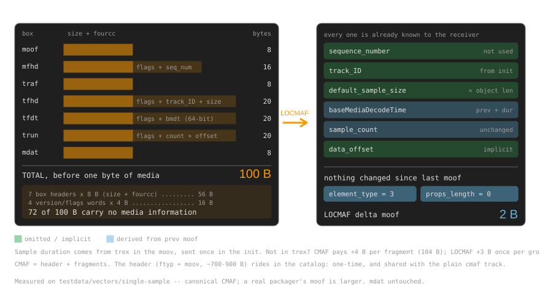

<!-- _class: lead -->
<!-- _paginate: false -->

# LOCMAF
## CMAF chunks at LOC overhead — with DRM

 

Torbjörn Einarsson · Eyevinn
RTC.ON · Sep 18 2026

<!--
[0:00–0:10]
"LOCMAF — Low Overhead CMAF for MOQ. One sentence: it sends real CMAF
chunks, with real DRM, for less per-object overhead than LOC.
Here's how."
Do NOT read the title slide out loud beyond that. Go.
-->

---

# You already know the problem

**CMAF = header + fragments.** The header (`ftyp` + `moov`, ~700–900 B) is needed **once** —
it rides in the CMSF catalog. LOCMAF leaves it alone.

**Each fragment** = one `moof` + one `mdat` = one MoQ object.
For low latency we push that down to **one sample per object**.

**Then every object costs 100 B of header before a single byte of media.**

| audio track                 | objects/s | container share of wire |
| --------------------------- | --------- | ----------------------- |
| AAC-LC 96 kbps              | 46.875    | **28 %** |
| Opus 32 kbps, 20 ms packets | 50        | **56 % — `moof` bigger than media** |

<!--
[0:10–0:55]
"First, framing. CMAF is a header plus fragments. The header — ftyp and moov —
is seven to nine hundred bytes, but you need it exactly once, and it rides in
the catalog, shared with the plain cmaf track. LOCMAF doesn't touch it. Forget
about it.

What LOCMAF attacks is the *fragments*. Each one is a moof plus an mdat, and
that's your MoQ object. For low latency we push it down to one sample per object.

And that's where it hurts: a hundred bytes of header before each media frame.
And audio is the worst case, because audio frames are small and frequent.
AAC at 48 kHz is 1024 samples a frame — 48000 over 1024, so 46.875 objects a
second. Times a hundred bytes: thirty-seven and a half kilobits a second of
pure moof. (One CMAF sample is one Opus *packet*, and Opus packets run 2.5 to
60 ms — so shorter packets cost proportionally more.)

Put that next to a 96 kbps AAC track: the container is twenty-eight percent of
your wire. And Opus at 32 kbps with twenty-
millisecond packets — that's fifty objects a second, same ballpark as video —
the moof is *bigger than the media it is describing*.

And Opus packets go down to two and a half milliseconds, so it can get worse.

That's the problem.

So: why a hundred bytes?"

TIMING: land on the last line at 0:55. This slide sets up the next one.
-->

---

# Why 100 bytes?

<!--
[0:55–1:40]
"Here it is, box by box. This is the *canonical*, already-minimal chunk —
a real packager emits more.

Seven boxes. Every one pays an 8-byte size-plus-fourcc header: that's
56 of the 100 bytes. Add four version-and-flags words, 16 more bytes.
So 72 of the 100 bytes carry no media information at all.

What's left is six numbers — and look at them. The sequence number nobody
uses. The track ID, which is in the init segment. The sample size, which
equals the mdat length, which MoQ already told you as the object length.
The decode time, which is the previous decode time plus the previous
duration according to CMAF. The sample count, which is one. And the data offset,
which is literally a hundred — it's the size of the header describing itself.

Every single one is already known to the receiver."

POINT AT the data_offset row if you have a pointer — the self-reference
always gets a laugh from an ISOBMFF crowd.
-->

---

# So send what's needed: almost nothing

**LOCMAF emits a value only when it cannot be derived from `moov` or previous fragments.**

A group mostly needs just two things: the first `baseMediaDecodeTime`, and the sample **duration**.

THe first object carries a **full LOCMAF header**. Every one after it is a **delta LOCMAF header**.

The receiver rebuilds a **function-identical** CMAF chunk. Normative *canonical reconstruction*,
pinned by golden vectors, so every conformant receiver produces the same bytes.

<!--
[1:40–2:10]
"So LOCMAF sends what changed.

A group only ever needs two things: the first baseMediaDecodeTime, and the
sample duration. And the duration you already have — it's in the trex box in
the moov, which came with the init, once.

The rule is simply: LOCMAF emits a value only when it *disagrees* with trex.
Agree with the moov and it costs nothing.

If the duration is not in trex, CMAF has to put it in the tfhd — four extra
bytes on every single fragment, forever: 104 instead of 100. LOCMAF sends it
once, three bytes, in the group's first object. Steady state is still two.

So the first object is a full header. Everything after is a delta. And in steady
state the delta is: element type three, properties length zero. Two bytes.

The mdat rides raw — no box header, because MoQ already gives you the length.

And this is transparent for many cases. The receiver reconstructs a function-identical
CMAF chunk, with sequence numbers starting at zero.
That's normative — canonical reconstruction, pinned by golden test vectors —
so two conformant receivers produce exactly the same bytes. Straight into MSE."
-->

---

# But isn't LOC already low-overhead?

|                        | **LOC**                        | **LOCMAF**                      |
| ---------------------- | ------------------------------ | ------------------------------- |
| carries                | raw codec frame                | CMAF chunk (`moof` + `mdat`)    |
| timestamp              | absolute, **every object**     | full header **once per group**  |
| per-object cost        | ~9 B (1 B ID + 8 B vi64) — *always* | 6–11 B first, then **2 B**  |
| encryption             | SFrame / Secure Objects (E2EE) | **CENC `cenc` / `cbcs` → CDM**  |

LOC targets conferencing: **one object per group** — nothing to delta against.
LOCMAF groups a whole GoP and **aligns audio groups to video**, so the timestamp is paid once and amortized.

<!--
[2:10–2:55]
"Fair question — LOC is *called* the Low Overhead Container.

LOC has to say what time it is on every object. The Timestamp property is
per-object, wall-clock microseconds by default: a 51-bit number, eight bytes of
vi64 plus one for the ID. Nine bytes, every object.

Be honest about this: LOCMAF's *first* object in a group also carries a
timestamp — the full header with the decode time. That's six to eleven bytes.
Comparable to LOC. There's no magic.

The difference is what comes after. LOC, built for conferencing, puts one object
per group — so there's never a previous object to delta against, and it pays nine
bytes forever. LOCMAF groups a whole GoP, and aligns the audio groups to the
video groups. So you pay the timestamp once, and everything after it is two bytes.

Two-second audio group, ninety-four objects: LOCMAF is one six-byte full header
plus ninety-three times two — about 190 bytes. LOC is ninety-four times nine —
about 850.

LOC is low-overhead by carrying less. LOCMAF is low-overhead by deriving more.
Complementary, not competing — LOCMAF even reuses LOC's property encoding."

IF RUNNING LONG: cut the arithmetic, keep "pay the timestamp once, then 2 bytes."
-->

---

# DRM: where it actually pays off

Encrypted `mdat` **verbatim**. Per-sample IVs, subsample maps, `tenc` defaults round-trip exactly —
receiver regenerates `senc` / `saiz` / `saio`. **The CDM sees byte-identical data.**

| media | single-sample chunk                 | CMAF header | LOCMAF  |
| ----- | ----------------------------------- | ----------- | ------- |
| video | clear                               | 100 B       | **2 B** |
| video | `cenc` — per-sample IV + subsamples | 169 B       | 12 B    |
| audio | clear                               | 100 B       | **2 B** |
| audio | `cbcs` — constant IV                | 100 B       | **2 B** |

**Video:** encryption adds `senc`+`saiz`+`saio` = **+69 B** to *every* fragment.
**Audio:** `cbcs` adds **nothing** — protection lives entirely in the `moov`.

<!--
[2:55–3:40]
"Now the part I came to show you.

The encrypted mdat goes on the wire verbatim — we never touch the ciphertext.
IVs, subsample maps, tenc defaults all round-trip, and the receiver regenerates
senc, saiz and saio. The CDM sees byte-identical data. LOCMAF is invisible to
the player.

Now audio — and the audio row does not move at all. cbcs audio has a constant
IV in the moov and no subsample encryption, so the fragment gets no senc, no
saiz, no saio. A hundred bytes clear, a hundred bytes protected, two bytes on
the LOCMAF wire either way.

Protected audio over LOCMAF is free.

IF ASKED "are these measured?": yes — every row is one sample per chunk, same
init, encoded and reconstructed with the reference codec. The only variable is
encryption.

Read it down by media type. Video: encryption takes the CMAF moof from 100 to
169 bytes — senc, saiz and saio get added to every single fragment, sixty-nine
bytes of it. LOCMAF pays twelve: just the IV and the subsample map.

And end to end on our 128 kbps AAC track: clear CMAF 171 kbps, protected CMAF
191. LOCMAF is 131.9 either way. Protected audio over LOCMAF is free."

THIS IS THE MONEY SLIDE. Spend any leftover seconds here.
-->

---

# Status

- Reference implementation: **`Eyevinn/locmaf`** — Go codec, CLI, golden vectors
- Interops end-to-end today: **moqlivemock** publisher/subscriber + **warp-player** in the browser
- In-browser conformance checker: **https://locmaf.dev/tools/** — drop a file, client-side

 

> Following the June 2026 MoQ interim, LOCMAF is being folded into
> **`draft-ietf-moq-cmsf`** as a packaging mode —
> **on the standards track inside the WG**, rather than as a standalone draft.

<!--
[3:40–3:55]
"There's a reference implementation — Go codec, CLI, golden conformance
vectors. It interops end to end today: our moqlivemock server and subscriber,
and warp-player in the browser. There's a drop-a-file conformance checker
at locmaf.dev slash tools.

And the standards story: after the June interim, we're not pushing this as a
standalone draft. LOCMAF is being folded into the working group's CMSF draft
as a packaging mode — so it goes onto the standards track inside the WG.
Review very welcome."
-->

---

<!-- _class: closing -->
<!-- _paginate: false -->

# 100 B → 2 B. DRM included.

[**locmaf.dev**](https://locmaf.dev) · `draft-einarsson-moq-locmaf` → `draft-ietf-moq-cmsf`

<!--
[3:55–4:00]
"A hundred bytes to two. DRM included. locmaf.dev. Thanks — questions?"

STOP TALKING. Do not add anything here.
-->
