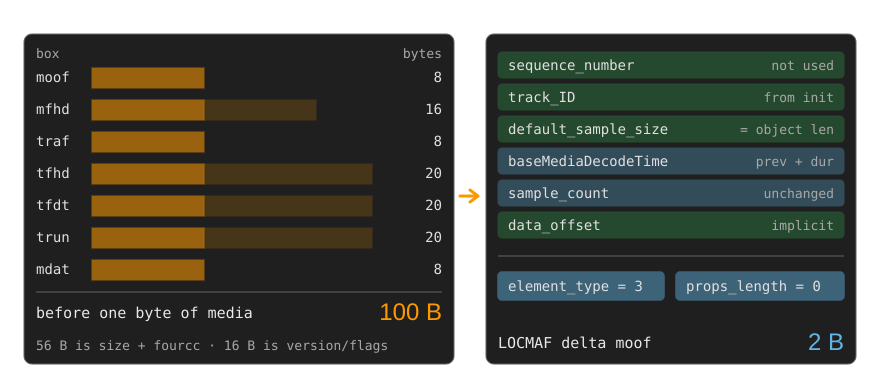
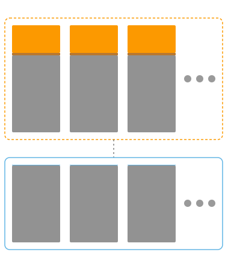

<!-- _class: lead -->
<!-- _paginate: false -->

# LOCMAF - the best of LOC and CMAF
## CMAF chunks at LOC overhead — with DRM

 

Torbjörn Einarsson · Eyevinn
RTC.ON · Sep 18 2026

<!--
[0:00–0:10]
"LOCMAF — the best of LOC and CMAF. Real CMAF chunks, real DRM, at LOC-level
overhead. Here's how."

Do NOT read the title slide out loud beyond that. Go.
-->

---

# CMAF fragment headers: `moof`

**CMAF = header + fragments.** The header (~700–900 B) rides in the CMSF catalog — **once**.

**Each fragment** = `moof` + `mdat` = one MOQT object
Lowest latency: **one frame per object**.

**100 B of header before a single byte of media.**

| audio track                 | objects/s | container share of wire |
| --------------------------- | --------- | ----------------------- |
| AAC-LC 96 kbps              | 46.875    | **28 %** |
| Opus 32 kbps, 20 ms packets | 50        | **56 % — `moof` bigger than media** |

<!--
[0:10–0:55]
"CMAF is a header plus fragments. The header — ftyp and moov — is seven to nine
hundred bytes, but you need it once, and it rides in the CMSF catalog. Forget it.

What we attack is the fragments. Each one is a moof plus an mdat: one MOQT
object. For lowest latency, one frame per object.

That is where it hurts — a hundred bytes of header before one frame of media.
Audio is the worst case: an AAC frame is 1024 samples, so 46.875 frames a
second at 48 kHz, and at 96 kbps the container is twenty-eight percent of your
wire. Opus at 32 kbps: the moof is bigger than the media.

So — why a hundred bytes?"

Say **frame**, not "sample": MP4 calls it a sample, but for audio that sounds
like one PCM sample. One frame = one CMAF sample = one Opus packet; Opus
packets run 2.5–60 ms, so shorter packets cost proportionally more.
TIMING: land the last line at 0:55.
-->

---

# Why 100 bytes?

**CMAF is constrained** — one track, one `trun`, one `mdat` per chunk, ...

<!--
[0:55–1:40]
"Box by box. Seven boxes, each paying an eight-byte size-plus-fourcc header —
fifty-six of the hundred. Four version-and-flags words add sixteen more. So
seventy-two of the hundred bytes carry no media information.

What is left is six numbers, and the receiver already knows every one. Sequence
number: unused. Track ID: in the init. Sample size: equals the mdat length,
which MoQ gave you as the object length. Decode time: previous plus previous
duration. Sample count: one. Data offset: literally a hundred — the header
describing its own size.

That only works because CMAF is constrained — one track, one trun, one mdat per
chunk. The structure is fixed, so it need not be sent."

This is the canonical, already-minimal chunk; a real packager emits more.
POINT AT data_offset if you have a pointer — the self-reference gets a laugh.
-->

---

<!-- _class: cols -->

# So send what's needed: almost nothing

**LOCMAF emits a value only when it cannot be derived from `moov` or previous fragments.**
First object of a group: a **full** header. Every one after: a **delta >= 2B.**
AAC 96kbps: **356 B → 258 B** per object

<!--
[1:40–2:10]
"So we send only what cannot be derived — from the moov, or from the previous
fragment. First object of a group: a full header. Every one after: a delta, two
bytes in steady state.

The picture is to scale for 96 kbps AAC. One frame is 256 bytes of media. CMAF
wraps it in that orange slab; LOCMAF replaces it with the cyan line — one pixel
at this scale. Same media underneath. 356 bytes becomes 258."

IF ASKED about duration: it normally sits in trex in the moov. If it does not,
CMAF pays +4 B on every fragment (104 B); LOCMAF pays +3 B once per group.
IF ASKED about fidelity: the receiver rebuilds a function-identical CMAF chunk
(sequence numbers zeroed) — normative canonical reconstruction, golden-vector
pinned, so conformant receivers agree byte for byte. Straight into MSE.
-->

---

# But isn't LOC already low-overhead?

|                        | **LOC**                        | **LOCMAF**                      |
| ---------------------- | ------------------------------ | ------------------------------- |
| carries                | raw codec frame                | CMAF chunk (`moof` + `mdat`)    |
| timestamp              | absolute, **every object**     | full header **once per group**  |
| per-object cost        | ~9 B (1 B ID + 8 B vi64) — *always* | 6–11 B first, then **2 B**  |
| encryption             | SFrame / Secure Objects (E2EE) | **CENC `cbcs` → CDM**           |

LOC targets conferencing: **one object per group** — nothing to delta against.
LOCMAF uses groups ~ a video GoP → the timestamp is paid **once**, then amortized.

<!--
[2:10–2:55]
"Fair question — LOC is *called* the Low Overhead Container.

LOC says what time it is on every object: wall-clock microseconds, eight bytes
of vi64 plus one for the ID. Nine bytes, every object, forever.

Be honest: LOCMAF's first object also carries a timestamp — six to eleven bytes.
Comparable.

The difference is what follows. LOC targets conferencing, one object per group,
so there is never a previous object to delta against. LOCMAF uses groups about
a video GoP, so you pay the timestamp once and everything after is two bytes.

LOC is low-overhead by carrying less; LOCMAF by deriving more. Complementary —
we even reuse LOC's property encoding."

IF TIME: two-second audio group, 94 objects — LOCMAF ≈ 190 B, LOC ≈ 850 B.
IF RUNNING LONG: cut that, keep "pay the timestamp once, then 2 bytes."
-->

---

# DRM: where CMAF is a must

Commercial DRM runs *Common Encryption* — raw codec frames can't get there.
Encrypted `mdat` rides **verbatim**; the CDM sees **byte-identical** data.

| media | single-sample chunk                 | CMAF header | LOCMAF  |
| ----- | ----------------------------------- | ----------- | ------- |
| video | clear                               | 100 B       | **2 B** |
| video | `cbcs` — clear + protected ranges   | 161 B       | 7–11 B  |
| audio | clear                               | 100 B       | **2 B** |
| audio | `cbcs` — constant IV, no subsamples | 100 B       | **2 B** |

**Video:** `cbcs` adds `senc`+`saiz`+`saio` = **+61 B** per fragment; LOCMAF re-sends only the ranges.
**Audio:** `cbcs` adds **nothing** — protection metadata lives entirely in the `moov`.

<!--
[2:55–3:40]
"And this is why the CMAF shape matters. Commercial DRM uses Common Encryption
and MSE/EME. WebCodecs has no DRM path — you cannot hand a CDM to a
WebCodecs decoder. So a raw-codec-frame container cannot carry protected
content. CMAF is not a preference here, it is the requirement.

The encrypted mdat rides verbatim; the CDM sees byte-identical data.

Video: cbcs takes the moof from 100 to 161 bytes — senc, saiz and saio on every
fragment, whatever the frame size. LOCMAF pays seven to eleven: just the clear
and protected ranges, which move with the frame.

Audio does not move at all: constant IV in the moov, no subsample encryption,
nothing added to the fragment. Two bytes either way. Protected audio over
LOCMAF is free."

IF ASKED "are these measured?": yes — one frame per chunk, same init, encoded
and reconstructed with the reference codec; encryption is the only variable.
IF ASKED about the range, or about big deltas at scene changes / high motion:
these are zigzag vi64 deltas, so the cost grows with the *logarithm* of the
jump, not the jump. A 20 kB, 100 kB or 1 MB swing all cost 3 bytes; 10 MB costs
4. And the field widths cap it outright — BytesOfClearData is uint16 (delta
≤ 3 B) and BytesOfProtectedData is uint32 (delta ≤ 5 B) — so one subsample can
never exceed ~14 B, whatever the content does. 7 B is the stable-clear case,
10–11 B when the clear length moves too. Assumes one subsample per frame;
per-NAL subsampling adds a few bytes per extra entry.
THIS IS THE MONEY SLIDE. Spend any leftover seconds here.
-->

---

# Status

- Internet Draft -> CMSF packaging mode
- **`Eyevinn/locmaf`** — Go code, CLI, golden vectors
- Online: **moqlivemock** + **warp-player** in the browser
- Independent implementations: **shaka-player** (just merged), moq-playa, ...

 

<!--
[3:40–3:55]
"The draft is being folded into CMSF as a packaging mode — standards track
inside the working group. Go reference implementation with golden vectors,
running in moqlivemock and warp-player. And it is not just us any more:
shaka-player merged LOCMAF support into main this week."
-->

---

<!-- _class: closing -->
<!-- _paginate: false -->

# 100 B → 2 B. DRM included.

[https://locmaf.dev](https://locmaf.dev)
[draft-einarsson-moq-locmaf](
https://datatracker.ietf.org/doc/draft-einarsson-moq-locmaf/)

<!--
[3:55–4:00]
"A hundred bytes to two. DRM included. locmaf.dev. Thanks — questions?"

STOP TALKING. Do not add anything here.
-->
