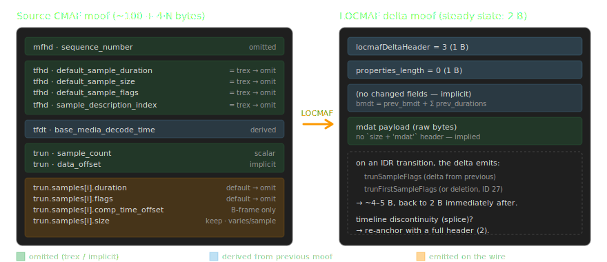
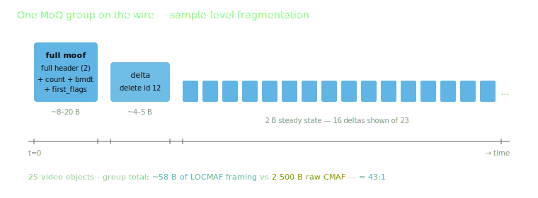
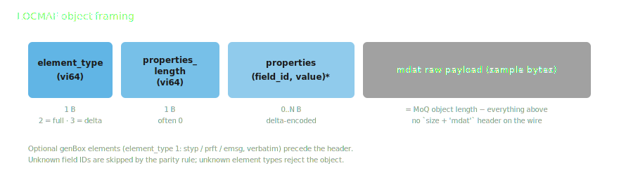

<!-- _class: lead -->

# LOCMAF
## Low Overhead CMAF for MOQ

<br>

Torbjörn Einarsson · Eyevinn · 2026
Initial version: Hugo Björs (KTH MSc thesis)

---

# Why a new packaging format?

- CMAF chunk = one `moof` + one `mdat`
- **Single-sample CMAF chunk header is ~104 B** of metadata
- LOC (~9 B) and WebCodecs carry **codec frames only** — no DRM, no CMAF semantics
- For low latency we want sample-level objects —
  moof overhead becomes a meaningful share of the wire cost (~25 % for low-bitrate audio)

> LOCMAF closes the gap to **as little as 2 bytes per delta moof** — and the same
> approach extends to **DRM-protected content** (`cenc` / `cbcs`, per-sample IVs,
> subsample maps carried verbatim, transparent to the CDM).

---

# The shape of the compression


- Big CMAF chunks on the sender side
- Tiny LOCMAF deltas on the wire — **as low as 2 B per moof** (~45 : 1 on clear-content moof bytes)
- **Functionally lossless** CMAF chunks reconstructed on the receiver —
  a normative *canonical reconstruction* makes conformant receivers byte-identical
- **Same shape for clear and DRM-protected content** — encrypted `mdat`, IVs, subsample maps round-trip unchanged

---

<!-- _class: section -->

# How MoQ groups map to CMAF

---

# One group per segment, one object per chunk


- **Group boundary = random access point** (IDR); audio groups align to video for joint tune-in
- **Object = one CMAF chunk**, delivered in order within the group — consecutive `moof`
  headers are almost identical: **that ordered series is what LOCMAF compresses**

---

<!-- _class: section -->

# Where LOCMAF wins:<br>the moof delta stream

---

# A moof has very predictable structure



---

# Two-stage compression

1. **Tfhd against trex defaults.**
   If `tfhd` already matches the `trex` defaults in the moov, omit it.
2. **Delta encoding within a group.**
   First `moof` per group is *full*; every subsequent `moof` is a *delta*
   carrying only what changed. BMDT is always derived from the previous moof —
   a timeline discontinuity re-anchors with a new **full** header mid-group.

`mdat` size is implied by the MoQ object length — the 8-byte `size + 'mdat'`
box header never goes on the wire.

---

# On the wire — one MoQ group



- Steady-state delta moof = **2 bytes** (`element_type` + `properties_length = 0`)
- IDR / discontinuity transitions cost a handful of extra bytes
- The rest of the group runs flat

---

# Measured compression


Measured with the v0.2 implementation; v0.3 keeps the same 2-byte steady state.

---

# Per-track wire bitrate (CMSF catalog)

| track                  | sample     | CMAF       | LOCMAF     | saved      |
| ---------------------- | ---------- | ---------- | ---------- | ---------- |
| `audio_128kbps_aac`    | 128.0 kbps | 171.5 kbps | 131.9 kbps | **23.1 %** |
| `video_400kbps_avc`    | 373.2 kbps | 396.4 kbps | 376.5 kbps |    5.0 %   |

- ~100 B → 2 B per moof ≈ **99.6 B/object** saved — essentially constant
- Percentage grows as track bitrate shrinks → **audio gains the most**
- 128 kbps AAC lands within ~3 % of the raw sample bitrate

---

<!-- _class: section -->

# Packaging

---

# The object payload is an element sequence



| element_type | Symbol              | Meaning                                   |
| ------------ | ------------------- | ----------------------------------------- |
| 1            | `genBox`            | pre-moof box (`styp`/`prft`/`emsg`), verbatim |
| 2            | `locmafFullHeader`  | full moof header (absolute)               |
| 3            | `locmafDeltaHeader` | delta moof header (in-group deltas)       |

---

# Properties: parity-typed tuples

The properties block is a flat sequence of `(field_id, value)` tuples — the LOC §2.3 parity scheme.

- **Even ID → scalar `vi64`** — absolute in a full header, zigzag delta in a delta header
- **Odd ID → length-prefixed bytes** — `vi64`-lists element-wise absolute / zigzag
- Three exceptions: **ID 5** comp-time offsets (zigzag in *both* — signed for B-frames),
  **ID 9** IVs (raw bytes in both), **ID 27** deleted-field list (plain unsigned)
- **ID 10** (BMDT) is full-header-only; **ID 27** is delta-only

Unknown field IDs are **skipped by parity** — the additive extension path.
Canonical encoding: ascending IDs, shortest `vi64` forms → byte-identical golden vectors.

---

# Full moof: what is emitted

A full moof starts each group (and re-anchors after a discontinuity). It carries
only fields *not* derivable from the moov's `trex` defaults:

- `trunSampleCount` (always) + `tfdtBaseMediaDecodeTime` (always)
- Per-sample arrays (`sizes`, `flags`, `comp_time_offsets`) only if the source's
  `tr_flags` set them — `sample_flags` carried as the full 32-bit value
- **`sizes` is dropped when `trunSampleCount == 1`** — the lone sample's
  size equals the `mdat` length, which the MoQ object length already gives us
- Encryption fields (`iv`, `subsamples`, …) only for encrypted tracks

For sample-level objects the typical full moof is **~6–20 B**.

---

# Delta moof: incremental encoding

1. **BMDT is always derived** — never emitted in a delta; a timeline
   discontinuity gets a mid-group **full** header instead
2. **Each value is a signed zigzag delta** of its previous representation:
   - scalar (even ID): single zigzag `vi64`
   - `vi64`-list (odd ID): zigzag deltas element-wise
   - raw bytes (ID 9 = IV): full bytes verbatim
3. `deltaDeletedLocmafIDs` (ID 27) lists fields removed since the previous moof

Empty payload = "no field changed since last moof." Steady state: **2 bytes**.

---

# What LOCMAF requires of the source

**CMAF-shaped MP4** (ISO/IEC 23000-19): one media track per CMAF Track,
one `trun` per `traf`, one `mdat` per chunk — that's what makes
"one MoQ object = one `moof` + one `mdat`" unambiguous.
Other fragmented-MP4 layouts must be repackaged first.

**Commensurate timescales** — integer frame duration in the media timescale:

| stream                       | timescale | ticks/frame |
| ---------------------------- | --------- | ----------- |
| 48 kHz AAC                   | 48 000    | 1 024       |
| 60000/1001 fps video (NTSC)  | 60 000    | 1 001       |

Otherwise durations drift ±1 tick, get sent every fragment, and the 2-byte steady state is lost.

---

# Init segments — verbatim via the catalog

- The CMAF Header (`ftyp` + `moov`) is **byte-identical** to what a
  plain `cmaf` track carries — LOCMAF has **no bespoke `moov` codec**
- MSF carries it in the catalog (`initDataList` / `initRef`) → init is a
  **one-time** cost amortised across the whole subscription
- A `cmaf` track and a `locmaf` track wrapping the same source can
  **share one init-data entry** — half the catalog bytes vs duplicating
- LOCMAF compresses the **per-chunk** overhead; init stays uncompressed

---

# Related: `draft-lcurley-compressed-mp4`

- Luke Curley's [`draft-lcurley-compressed-mp4`][lcurley] is a generic
  ISOBMFF box-header compression scheme
- Per-fragment overhead ~100 B → **~20 B**
- Headline figure assumes **small `baseMediaDecodeTime`** (varint-friendly)
  and **no encryption boxes** (`saiz`/`saio`/`senc`/`tenc`)
- LOCMAF goes further for the MoQ case: **2 B steady-state** delta moof,
  encrypted `mdat` and CENC metadata carried verbatim, DTS delta-encoded so
  absolute timestamp size doesn't matter

[lcurley]: https://datatracker.ietf.org/doc/draft-lcurley-compressed-mp4/

---

<!-- _class: section -->

# DRM with LOCMAF

---

# Designed for protected MoQ streaming

- Primary use case: **low-latency DRM-protected streaming over MoQ**
- Encrypted `mdat` bytes carried **verbatim** — no re-encryption, no metadata loss
- Per-sample IV, subsample maps, `tenc` defaults (KID, IV size, pattern) all round-trip exactly;
  the receiver regenerates `senc` / `saiz` / `saio` canonically
- Standard CDM / MSE / EME path on the receiver — **LOCMAF is invisible to the player**

> "Functionally lossless" extends to the CDM: the bytes the CDM reads — ciphertext, IVs, subsample ranges, KID — are byte-identical end-to-end.

---

# Catalog DRM signaling

CMSF carries the DRM description; LOCMAF doesn't replace it.

```json
{
  "contentProtections": [{
    "refID": "widevine", "scheme": "cbcs", "defaultKID": ["abcdef…789"],
    "drmSystem": { "systemID": "edef8ba9-…", "laURL": "https://lic.example.com/wv",
                   "pssh": "<base64-pssh>" }
  }],
  "initDataList": [{ "id": "v1init", "type": "base64", "data": "…" }],
  "tracks": [{
    "name": "video_400kbps_avc_drm",
    "packaging": "locmaf", "locmafVersion": "0.3",
    "contentProtectionRefIDs": ["widevine", "playready"],
    "initRef": "v1init"
  }]
}
```

---

# `cenc` vs `cbcs` on the wire

| scheme | per-sample IV         | subsample map     | extra delta-moof cost  |
| ------ | --------------------- | ----------------- | ---------------------- |
| `cenc` | per-sample, 8 or 16 B | ~3 B/subsample    | IV bytes + subsamples  |
| `cbcs` | constant IV in `tenc` | ~3 B/subsample    | subsamples only        |

- **Audio cbcs == audio clear** on the LOCMAF wire — no subsample encryption, constant IV in the moov
- Video carries the subsample map under both schemes
- The carriage is **scheme-agnostic**: `cbc1` / `cens` ride the same fields;
  per-sample IVs are always explicit

---

# Bitrate under DRM (measured)

| track            | scheme | CMAF       | LOCMAF     | saved      |
| ---------------- | ------ | ---------- | ---------- | ---------- |
| AAC 128 kbps     | `cbcs` | 191.4 kbps | 131.9 kbps | **31.1 %** |
| AAC 128 kbps     | `cenc` | 197.4 kbps | 138.6 kbps |    29.8 %  |
| AVC 400 kbps     | `cbcs` | 408.8 kbps | 378.5 kbps |     7.4 %  |
| AVC 400 kbps     | `cenc` | 412.0 kbps | 382.1 kbps |     7.3 %  |

LOCMAF saves **more** relative to CMAF under DRM than on clear content — the encrypted CMAF moof grows (`senc` + `saio` + `saiz`), while LOCMAF only emits what it needs.

---

# Extensibility & versioning

- **No IANA registry needed** — no LOCMAF codepoint leaves the payload;
  the catalog's `packaging: "locmaf"` scopes the bytes before any object arrives
- Extension points, both self-delimiting:
  **new `genBox` box types** (verbatim ISOBMFF boxes) and
  **new field IDs** (skipped by the parity rule)
- Element types are fixed per version — an unknown `element_type` **rejects the
  object**, so no two receivers ever reconstruct different chunks
- `locmafVersion` (`"0.3"`) signals reinterpretation of existing wire syntax;
  a receiver never subscribes to a version it doesn't support —
  the catalog can offer the same source under `cmaf` as fallback

---

# Summary

- **Per-fragment moof compression** is the contribution
  - Sample-level objects: **2 B steady-state delta moof** = **45 : 1** on moof bytes
- **Init is carried verbatim** via the catalog — one-time cost, shared with `cmaf` tracks
- **DRM is end-to-end transparent** — the CDM sees byte-identical data
- **Canonical reconstruction** makes conformant receivers byte-identical — golden-vector testable
- Reference implementation in [Eyevinn/moqlivemock][moqlivemock] +
  [Eyevinn/warp-player][warp-player], demo at [moqlivemock.demo.osaas.io][demo]

[moqlivemock]: https://github.com/Eyevinn/moqlivemock
[warp-player]: https://github.com/Eyevinn/warp-player
[demo]: https://moqlivemock.demo.osaas.io

---

# References

- [draft-einarsson-moq-locmaf](https://datatracker.ietf.org/doc/draft-einarsson-moq-locmaf/) — **LOCMAF (this specification)**
- [draft-ietf-moq-transport](https://datatracker.ietf.org/doc/draft-ietf-moq-transport/) — Media over QUIC Transport
- [draft-ietf-moq-cmsf](https://datatracker.ietf.org/doc/draft-ietf-moq-cmsf/) — CMAF MoQ Streaming Format
- [draft-ietf-moq-loc](https://datatracker.ietf.org/doc/draft-ietf-moq-loc/) — Low Overhead Container
- [draft-lcurley-compressed-mp4](https://datatracker.ietf.org/doc/draft-lcurley-compressed-mp4/) — Compressed MP4
- **ISO/IEC 14496-12** ISO BMFF · **ISO/IEC 23000-19** CMAF · **ISO/IEC 23001-7** CENC
- *Efficient DRM in MoQ using Low Overhead CMAF* — Hugo Björs, KTH MSc Thesis, 2026

---

<!-- _class: closing -->

# THANK <span class="cyan">YOU</span>!

[**locmaf.dev**](https://locmaf.dev) · [github.com/Eyevinn/moqlivemock](https://github.com/Eyevinn/moqlivemock)
